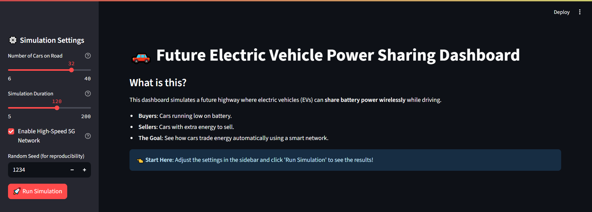
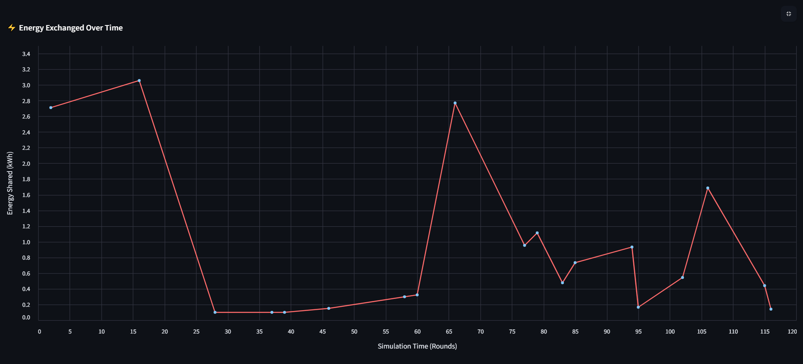
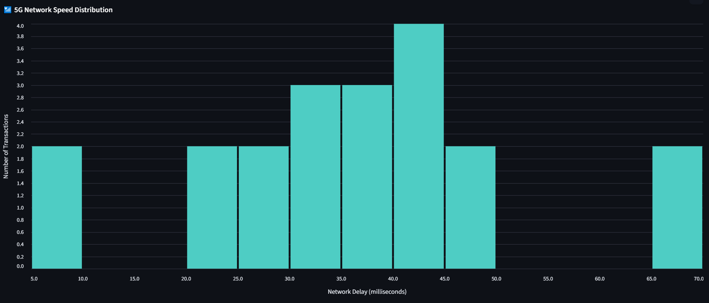
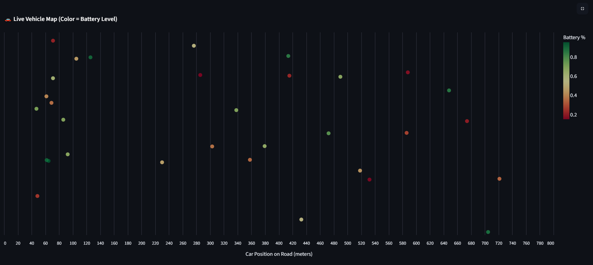

# V2V Inductive Charging Simulation — Realistic Demo

This project is a visual dashboard for simulating Vehicle-to-Vehicle (V2V) wireless charge sharing using game-theoretic bidding and secure blockchain payments. It visualizes energy transfer, transaction logs, and vehicle positions on a roadway.

## Table of Contents
1.  [Prerequisites](#prerequisites)
2.  [Installation](#installation)
3.  [Running the Simulation](#running-the-simulation)
4.  [Features & Controls](#features--controls)
5.  [Troubleshooting](#troubleshooting)

---

## 1. Prerequisites

Before you begin, you need to have **Python** installed on your computer.

### How to check if Python is installed:
1.  Open your **Command Prompt** (on Windows) or **Terminal** (on Mac/Linux).
    - *Windows:* Press `Win + R`, type `cmd`, and press Enter.
    - *Mac:* Press `Cmd + Space`, type `Terminal`, and press Enter.
2.  Type the following command and press Enter:
    ```bash
    python --version
    ```
    or
    ```bash
    python3 --version
    ```
3.  If you see a version number (e.g., `Python 3.10.x`), you are good to go.
4.  **If not installed:** Download and install it from [python.org/downloads](https://www.python.org/downloads/). **Important:** During installation on Windows, check the box that says **"Add Python to PATH"**.

---

## 2. Installation

Follow these steps to set up the project locally.

### Step 1: Open the Project Folder
1.  Navigate to the folder containing these files (`main.py`, `requirements.txt`, etc.).
2.  Open your command prompt/terminal directly in this folder.
    - *Windows Tip:* Open the folder in File Explorer, type `cmd` in the address bar at the top, and press Enter.

### Step 2: Install Required Libraries
This project relies on a few external tools (libraries). We have listed them in `requirements.txt`.

Run the following command in your terminal:

```bash
pip install -r requirements.txt
```

*Note: If `pip` doesn't work, try `pip3 install -r requirements.txt`.*

This will automatically install:
- `streamlit` (for the dashboard)
- `pandas` (for data handling)
- `altair` (for charts)
- `numpy` (for calculations)

---

## 3. Running the Simulation

Once installation is complete, you can start the application.

1.  In your terminal (make sure you are still in the project folder), run:
    ```bash
    streamlit run main.py
    ```

2.  Wait for a few seconds. A local web server will start, and your default web browser should automatically open a new tab showing the dashboard.
    - If it doesn't open automatically, the terminal will show a URL (usually `http://localhost:8501`). Copy and paste that into your browser.

---

## 4. Features & Controls

Once the dashboard is running:

### Sidebar Controls (Left Panel)
- **Number of vehicles:** Adjust the slider to choose how many cars are in the simulation (6 to 40).
- **Rounds:** Choose how long the simulation runs (5 to 200 rounds).
- **Enable High-Speed 5G Network:** Check this for lower network latency (faster transaction simulation).
- **Random seed:** Keep this number constant to reproduce the exact same results later.
- **Run Simulation:** Click this button to start the process.

### Dashboard outputs
After clicking "Run Simulation", you will see:
1.  **Energy transferred per round:** A line chart showing total energy exchanged over time.
2.  **Latency distribution:** A histogram showing network delays.
3.  **Vehicle positions (1D map):** A visual representation of cars on the road, colored by their battery level.
4.  **Data Export:** Buttons to download the results as CSV files (Excel compatible):
    - *Energy Data*
    - *Full Logs*
    - *Vehicle Summary*
    - *Ledger Data*
5.  **Tables:** Detailed view of transaction logs and ledger.

---

## 5. Troubleshooting

- **"Command not found" error:** 
  - Make sure Python is added to your system PATH. Re-install Python and check the "Add to PATH" box.
- **Dependency errors:** 
  - Try running `pip install --upgrade pip` and then run the installation command again.
- **Browser doesn't open:** 
  - Look at the terminal output and manually copy the `http://localhost:8501` link.
- **Port already in use:** 
  - If it says port 8501 is busy, it will likely try 8502. Just check the URL provided in the terminal.

---

## 6. Gallery & Results

**📸 Project Screenshots & Work Details**

Below is a detailed breakdown of the simulation's visual outputs.

### 1. Full Dashboard Overview

**Description:**  
Displays the main dashboard with simulation controls (left) and aggregated real-time metrics including total energy exchanged, successful deals, and network speed.

---

### 2. Energy Analysis Chart

**Description:**  
Tracks the cumulative energy (kWh) transferred between vehicles over time, visualizing the efficiency and activity of the V2V power-sharing marketplace.

---

### 3. Network Latency Distribution

**Description:**  
A histogram showing the distribution of transaction latencies (ms), illustrating the performance and responsiveness of the simulated 5G network infrastructure.

---

### 4. Live Traffic Map

**Description:**  
Visualizes vehicle positions on the highway: **Green** dots denote charged sellers, and **Red** dots denote low-battery buyers, confirming proximity-based interactions.

